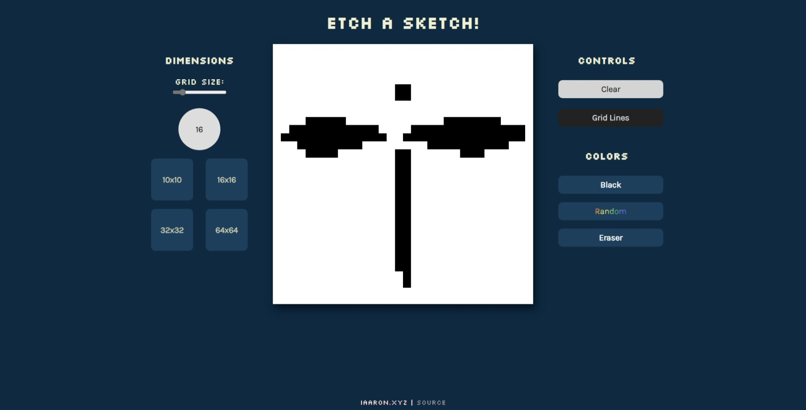

# etch-a-sketch
This a simple sketchpad web-app tool, here you can create a simple pixel art within a grid of initrial size of 16x16 pixels. That size can be changed within a range from 8x8 to 100x100 using a slider or press a button with a specific value.

You can check and play with the live demo [here](https://iaaron-xyz.github.io/etch-a-sketch/).

